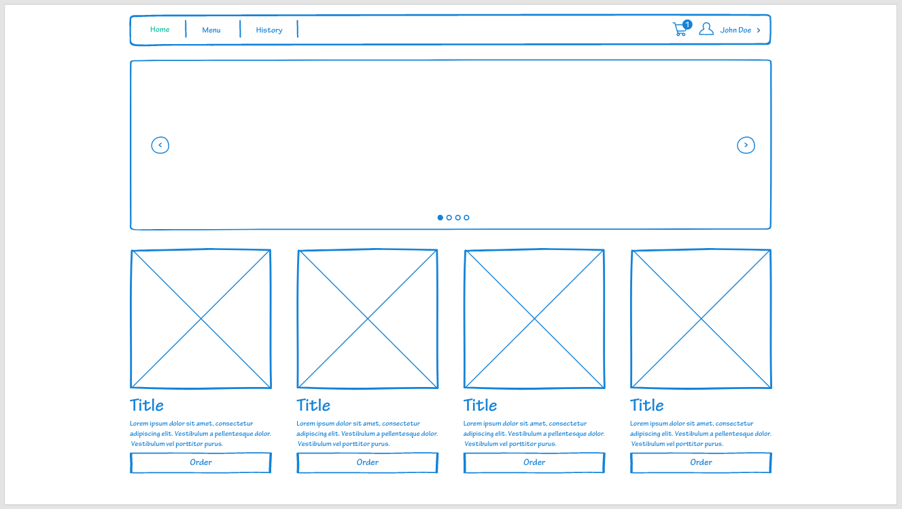
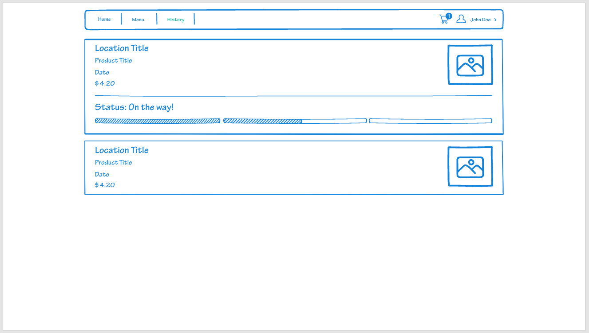
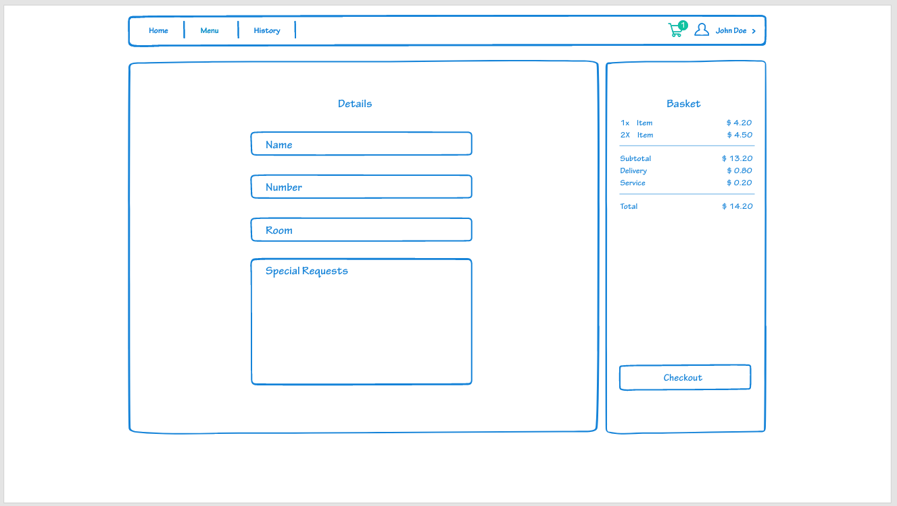

# DELIVERSITY

## 1.0 Introduction

With the return to campus for most students at Solent University there has been an increase of foot traffic in and around the cafeteria and cafe areas due to the ease of access for various food and drink items. These facilities are used by students and teachers to varying degrees at all moments of the day, often resulting in large queues and extended waiting periods for orders to be purchased, processed and, depending on the item, produced. 

A direct result of which is students arriving late to their respective lectures or, in some instances, tired due to the lack of their morning coffee. An observable assumption I have made due to my early morning lectures requiring me to pass by the Spark buildings cafe, strengthened by conversations I have had with friends in different fields of study as they all have had complaints about this issue.

Specific findings I have noted after my initial conversations with them include, but are not limited to:
- The waiting time for the queue/coffee often resulting in them arriving late to a lecture and missing the initial summary
- An occasional want/need to get a food or drink item during a lecture to be high though they are unable to as it would disrupt their studies
- The distance to the cafe/cafeteria facilities to be too far, especially when it comes to differently abled students
- The lack of knowledge concerning further food and drink facilities outside of the Spark building

#### Problem Statement

University students need a way to purchase orders from the various food and drink facilities on campus which least disrupts their class time.

## 2.0 Methods/Methodology
### 2.1 Overarching Methodology

#### Design Thinking

Design Thinking is the methodology I have chosen to make use of due to its highly user-centric and progressive core values. Specifically, after reading up on its four principles that were laid out by Christoph Meinel and Harry Leifer from Stanford University, as discussed below, I was certain this is ideal for the project.

##### The Four Rules 
1. The human rule:
   - "All design activity is social in nature”
   - As this project is created for a specific human need, it is important to satisfy their requirements
   - This rule enables me to focus on possible clients input and requirements to iterate and create a satisfactory product

2. The ambiguity rule
   - "Ambiguity is inevitable"
   - As in all design, there will come situations where I would be unfamiliar with certain technologies
   - This rule allows for things that are not thoroughly understood to be researched and amended throughout the development cycle

3. The redesign rule 
   - "All design is redesign"
   - As I am planning on creating a delivery app It would be pointless to attempt to reinvent the wheel in this situation
   - Instead drawing inspiration from existing popular apps and repurposing features of their design into my product

4. The tangibility rule 
   - "Making ideas tangible enables effective communication"
   - This aligns with the specification of the assessment on as we are required to produce a prototype for the application
   - It would also be ideal to get valuable feedback from clients and iterate until the design is at a satisfactory state for them, encompassing all key features they desire

##### The Five Phases

While researching Design Thinking I choose to investigate the modern 5 phases approach as proposed by the Hasso-Plattner Institute of Design at Stanford University. As it seemed more applicable to my project than the original 7 phase approach.

However, these phases are not linear and lack a strict ending point. Hence even when reaching the final test phase, it is possible that more improvements or issues could arise, all of which could require backtracking with this new information to define the solution further with new knowledge.

1. Empathize
   - A critical phase where an understanding of the problems you are trying to solve come from. 
   - By seeing the issues from the perspective of user you'd understand the problems they face daily 
   - Ideal for this project as I am also a student who can relate to issues my peers face to some extent
   - This is achieved by identifying the need and addressing it. 
   - A phase with major focuses on research, specifically client based
   - Which directly would influence my methods for researching

2. Define
   - After the problem is identified need and suitable research is collected
   - A person can define the problem in human-centric terms
   - Specifically defining the problem in broad terms
   - Allowing for a flexible and creative approach, with possibilities to hone the specifics
   - Meaning the information gathered would have to directly narrow and further define my previously mentioned problem statement
   - Through homing in on specifics and narrowing solution possibilities I can create a suitable solution to address their problems

3. Ideate
   - When an understanding of a user’s problems has been identified, and gathered data has been analysed 
   - Ideas can begin to be generated, all of which aim to be a suitable solution to solve the defined problem
   - This phase especially focuses on "free thinking and unconventional approaches"
   - This stage directly contributes to my proposed solution as a whole and will allow me to create a solution based on research from my methods employed

4. Prototype
   - When all is said and done, I will be able to take my most suitable idea and begin production
   - This prototype for sake of this project will be an adobe XD mock-up
   - Of which I can gather user responses and general feel
   - The user testing allows me to identify adjustments and missing elements 

5. Test
   - This phase consists of taking all feedback from the prototyping phase and creating a complete product
   - Something which will be the topic of my next report instead of this one

### 2.2 Methods

After initial discussions took place with my peers and I was able to empathise then identify a problem I could attempt to solve, I decided to move on to the next design thinking phase and define the problem further. To accomplish this, I ran 2 different focus groups of 6 and 12 members respectively to get a grasp on what different users would require in a delivery solution.

#### Focus Groups 1

This focus group consisted of 6 members all from a subject relating to the computing field, giving them the means to discuss more technical aspects they would have liked to see incorporated. From this group I gathered insights that helped me clearly define key features discussed below:

- A system which provides a secure login for users to register, with addition of OAuth sign in capabilities for ease of use
- A method to track orders progress after purchase, represented in states to users so that they can know the status
- A user account that allows key contact information to be stored and updated as required

#### Focus Group 2

This group consisted of 12 members who were on various non computing courses and provided me with an insight into what they wanted from the solution. These insights included generalized features that will be discussed below:

- A way to view deals on food and specific offers cafes currently have on campus
- An overview of the various food and drink premisses with clear descriptions and identifiers on what they offer
- A simple menu system that is organised and easy to navigate throughout the users own journey

#### Shared findings

While discussing this issue with my 2 focus groups there were a few shared needs between them. These include

- A lack of knowledge on the different food and drink locations at the Uni
- A want to be able to specify any requests or changes to purchased items
- The ability to specify the room they are currently located in
- A clear overview of the items they have added to their basket with clear communication on the cost and fees involved before they can checkout

### 2.3 Proposed Solution

When considering all the above findings it is evident a solution that would address all these requests would be a delivery application where students could choose the facility they would like to order from, enter their corresponding classroom or location and have their requests delivered to the door, making it is possible for them to pick it up quickly without disrupting class or study times at any time of the day. 

Making use of a design thinking approach to further ideate through different solution and test user responses to create a suitable product that meets their needs accordingly. As this project is in nature human driven, I believe this human centric design is best suited for crafting a solution.

## 3.0 Ethics

I submitted an ethics clearance request for this project at the https://ethics.app.solent.ac.uk/ and made sure to specify according to the form. This makes sure that my project will not disregard users and testers safety. Moreover, as I will be working with people’s personal data, I will be adding T&C and privacy policies, as well as making sure my project is GDPR compliant.

## 4.0 Discussion, Results and Prototype

Below you can find a detailed mock-up of my solution to this problem with key features explained and justified following it. I made use of Adobe XD to produce this with one of their free XD Kits, specifically the hand drawn kit.

https://xd.adobe.com/view/5583c407-bf60-46d7-b83f-b1b2550fb096-00d0/

This solution clearly demonstrates how my proposed solution will look and function with all its major components being presented as well as a generic flow of it. The below screenshots will be further elaborated on as they were all heavily informed by user specific requirements, as discussed under methods section of this report.

### Homepage

The homepage of this application is a standard view encompassing various standardized design elements, such as list views and image slideshow. This allows me to add to the list view all the different facilities on campus and clearly communicate to my users the different options available to them. Directly addressing an issue brought to light during my initial focus group sessions. 

Moreover, by providing a title followed by a short description of services on every grid title in the list, users would know what to expect from the facility if they were to place an order. With the addition of a picture element allowing them to easily identify brands present, as many students in my focus groups could not roughly identify what these facilities would be selling as a product.

Whereas the slideshow could be used to immediately let users know of any available deals or discounts the corresponding facilities are offering. Addressing another substantial point brought up by my second focus group, where a few participants did not know that one of the cafes offered meal deals to students, as it is often associated with larger chains. 

### Order

It was important for my focus group to know the status of their order during the initial discussion. In any situation not knowing a rough time window of when to expect their purchase meant they would sit there waiting and, in their words, "rather be focused on the unknown status of the delivery than class". Hence, I produced a design accordingly where all your previous orders have been listed, with the top of the stack portraying larger than the rest as it would indicate a status alongside information given.

This system draws inspiration from other applications such as Deliveroo and Uber Eats as design thinking’s principles state that all design is redesign, except for 3 simpler states to display the phase the order is in. 

### Checkout

The checkout section provides users a clear and concise view of their order and its overall cost, with features directly drawing inspiration from standard checkout systems as all design is redesign. The extra fees and such would be coupled to delivery fees and stripe payment fees as it is the system I will be using to securely manage payments.

Moreover, the details section is heavily influenced by focus group members, with fields such as number and name being fields that will automatically be filled with user profile information. As well as specialised fields such as room and special requests that will allow users to stipulate their current room location in the Uni premise and make special requests for preparation of items or allergy information respectively.

### User Response

After running this design by multiple participants of my focus group I would say that the mock-up is quite the success and meets their needs accordingly, providing aspects they requested and beyond. Some worthwhile improvements were also mentioned after the fact, most of which will be elaborated on below:

- Within the order list, users wanted to see a button which would allow a reorder of previously purchased items, which would both save time and allowing them to "focus more on class" rather than spend time searching for the same items again.
- For the checkout system they also mentioned an addition for allergy preferences to be auto filled and be associated with their account as they thought it could get lost if put under special request strictly
- An option to choose to pick up an order instead of having it delivered to a room would also be ideal especially for long lecture breaks

Other than this the satisfaction was overall high for my project, and I would deem it a success to solving the issue as it is an example of a functional ordering application. Where users can place, purchase, and track their orders to their specified class locations.

## 5.0 Conclusion

By making use of a design thinking methodology, I was able to empathise, define and ideate a suitable solution for university students in their day to day lives, specifically a way to purchase orders from the various food and drink facilities on campus which least disrupts their class time.

To which I have decided to create a delivery application where orders can be delivered to the class door. This is as a response to the focus group methods I employed during the define phase.

The project has also successfully undergone the prototype phase with suitable responses from focus group users and is ready to enter the final test and production phase.

# Reference List
- https://careerfoundry.com/en/blog/ux-design/what-is-design-thinking-everything-you-need-to-know-to-get-started/#:~:text=%20The%20Four%20Principles%20of%20Design%20Thinking%20,enables%20designers%20to%20communicate%20them%20more...%20More%20
- https://adobexdelements.com/hand-draw-wireframe/
- https://s3.xopic.de/openhpi-public/pages/research/3hLb612tOeW2BMI0CqaWLB/Towards_More_Human_Centered_TRAIFEH_STAUBITZMEINEL.pdf
